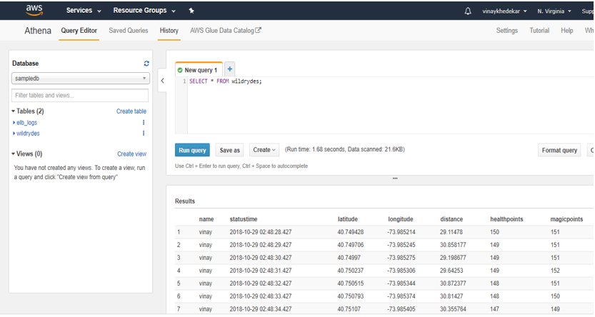

# AWS-Serverless-Real-Time-Data-Processing

AWS to build applications to process and visualize this data in real-time. Also, AWS Lambda to process real-time streams, 
Amazon DynamoDB to persist records in a NoSQL database, Amazon Kinesis Data Analytics to aggregate data, Amazon Kinesis Data Firehose 
to archive the raw data to Amazon S3, and Amazon Athena to run ad-hoc queries against the raw data.

1. Build a data stream

   Step 1. Create an Amazon Kinesis stream
   Step 2. Produce messages into the stream
   Step 3. Read messages from the stream
   Step 4. Create an identity pool for the unicorn dashboard
   Step 5. Grant the unauthenticated role access to the stream
   Step 6. View unicorn status on the dashboard
   
   
   
2. Aggregate data

   Step 1. Create an Amazon Kinesis stream
   Step 2. Create an Amazon Kinesis Data Analytics application
   Step 3. Read messages from the stream
   
   
   
3. Process streaming data

   Step 1. Create an Amazon DynamoDB tables
   Step 2. Create an IAM role for your Lambda function
   Step 3. Create a Lambda function to process the stream
   Step 4. Monitor the Lambda function
   Step 5: Query the DynamoDB table
   
   

4. Store & query data

   Step 1. Create an Amazon S3 bucket
   Step 2. Create an Amazon Kinesis Data Firehose delivery stream
   Step 3. Create an Amazon Athena table
   Step 4. Explore the batched data files
   Step 5: Query the data files

   
